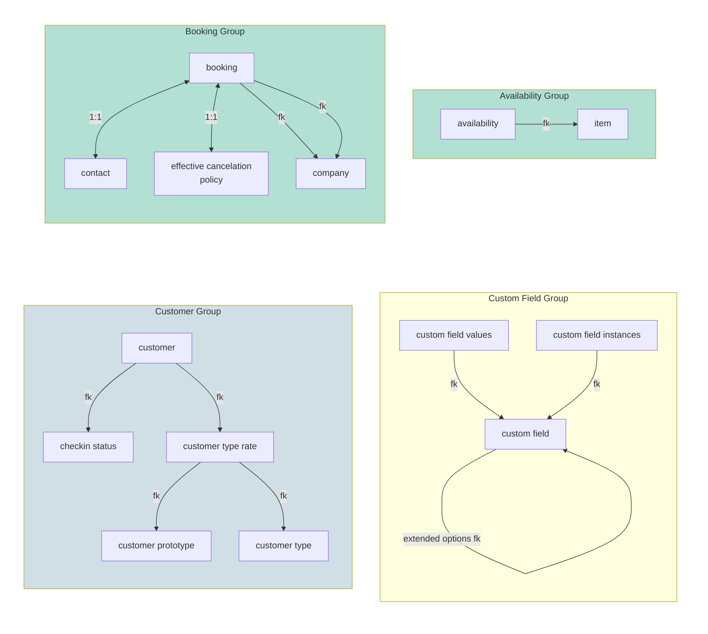
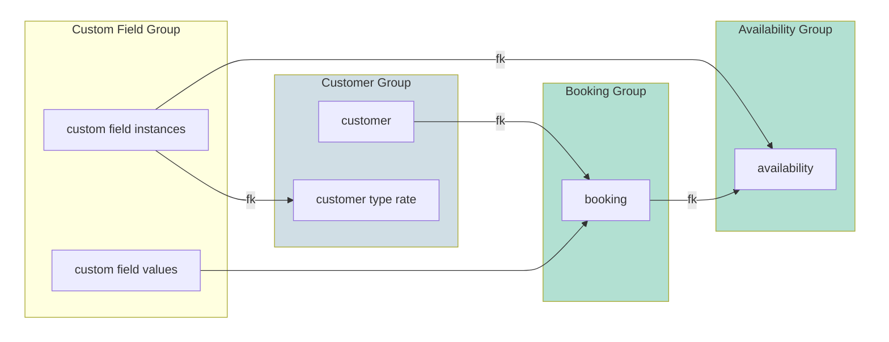

# Fareharbor webhook
This is a simple app written in flask to process the webhooks provided by [Fareharbor](https://github.com/FareHarbor) which is a booking engine for activities.

# Motivation
Fareharbor app provides a great interface to deal with bookings for activities and a powerful reporting tool. However, it lacks visualizations about how the business is performing so usually one has to download the report for a given period and then manipulate the data.

With this webhook we have access to the booking instances in the moment they are produced or modified which allows to have live data to pull from a database and then make some visualizations using a tool for that purpose, like [redash](https://redash.io/)


# Installation
## Virtual environment
Create a virtual environment using your preferred approach
```shell
cd flask_app
python -m venv venv
source venv/bin/activate
```

Install the requirements
```shell
pip install --upgrade pip
pip install -r requirements.txt
```

## Create a db
You will need a couple of postgres dbs running under the hood, one for the data and the other for the tests as pytest does not create temp databases (or at least I didn't find how)

```shell
createdb webhook-sample
createdb webhook-tests
```

## Fill .env vars
Now head to .env-sample, clone to .env and replace the values with your local details:
```shell
cp .env-sampe .env
vim .env  # or your favourite editor
```

## Migrate the db
Once you have ready the details relative to the db you can migrate the models:
```shell
export FLASK_APP=fh_webhook  # you can also use export FLASK_APP=run.py
flask db migrate  # build the migration files
flask db upgrade  # apply the migrations in the db
```

## Run the server
With above, everything is in place to store requests, so spin up the server:
```shell
export FLASK_APP=fh_webhook
export FLASK_ENV=development
flask run
```

Finally you can just curl it from another terminal:
```shell
curl localhost:5000/test
# Hello from Flask
```

## Posting a sample file
With the server running you can record your first request in the db making use of the sample used in the tests
```shell
cd flask_app/tests
curl -H "Content-Type: application/json" -X POST \
--data @1626842330.051856.json \
fareharbor:FH_PASSWORD@localhost:5000/
```

Then on postgres you should have the sample
```sql
SELECT * FROM booking;
```

## Accessing the flask shell
An ipython shell is included in the requirements
```shell
export FLASK_APP=fh_webhook  # as always remember to say where flask lives
flask shell
```

## Run the test suite
```shell
export FLASK_APP=fh_webhook  # as always remember to say where flask lives
python -m pytest tests
```

# Database schema
The following charts are written in [mermaid](https://mermaidjs.github.io/) which is a very cool tool to draw diagrams using just the keyboard. Github doesn't display them out of the box but there's a [nice addon](https://github.com/BackMarket/github-mermaid-extension) for browsers to see them.

## Per group
To easily understand the underlying structure, we can split the models in groups, these are:
* **Availability group:** this includes the availabilty model and the item model. Items are the products in the Fareharbor account, whereas availability controls the spots where activities can be allocated.
* **Booking group:** stores all the booking details along with some 1:1 fields: contact, that stores the booker contact data, and the cancellation policy.
It also contains the company models that is reached twice by two fields in the booking model: company, namely webhook owner company, and affiliate company, that points affiliates if any.
* **Custom Field group:** stores all the information related to custom fields: Each availability has several custom field instances whereas each booking stores the selected data in the custom field values model. Both effectivelly make a m2m to predefined custom fields.
* **Customer group:** Finally the customer group registers all the data relative to pricing for each availability and the checkin status



## InterGroups relationships
At a higher level each booking can have several customers and each availability can have several bookings. There are also some connections that provide effectively m2m relationships:
* **Custom field values** make the m2m relationship between predefined custom fields and the chosen values for and specific booking or a customer. Note that there are custom fields that are booking level and some other custom fields at customer level.
* **Custom field:** Likewise, we have custom field instances for either availabilities or customer type rates that define which custom fields are available prior to choose a value by the contact.



